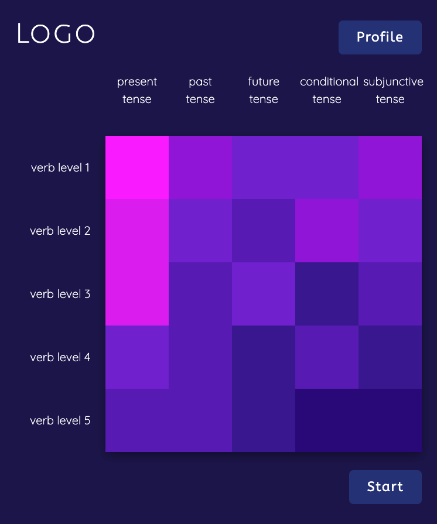
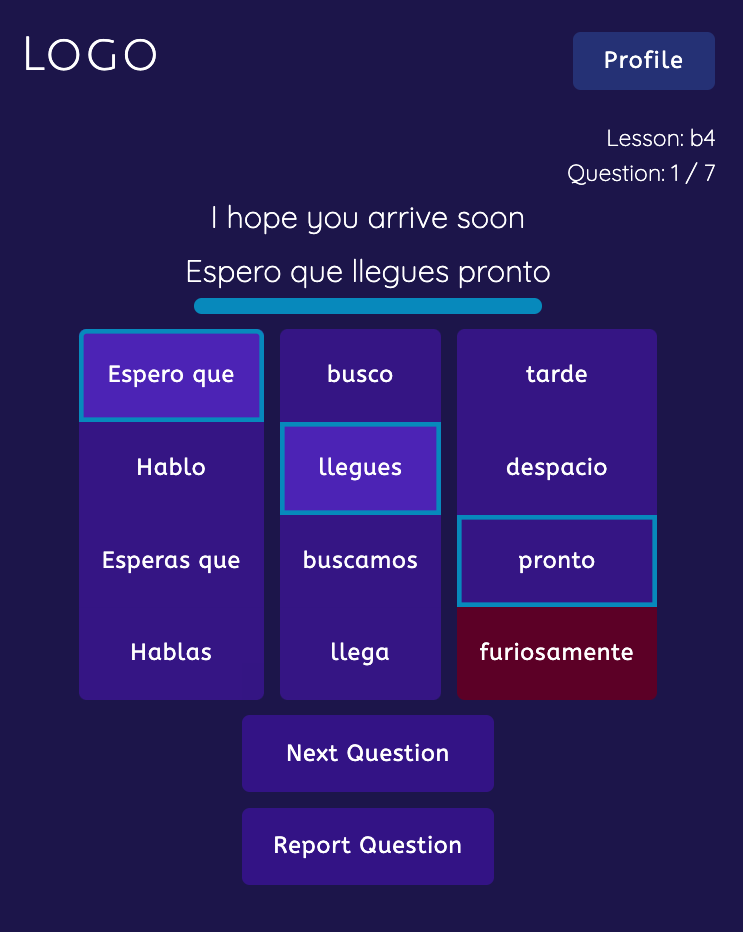

# Mosaica
## Overview
Mosaica is an app that allows users practice written Spanish by drilling on different families of verbs and different tenses. Mosaica keeps track of a user's recent performance and displays it in an easy to understand grid. The grid also serves as the menu from which to select which verbs and tenses to drill on.

[Deployed project](https://incandescent-zabaione-1ecef0.netlify.app/)

[Github Repo](https://github.com/patrick24cr/mosaica)

[Project Board](https://github.com/users/patrick24cr/projects/5)

[Wire Frame](https://www.figma.com/file/Y9XSfhBsSJ1c65mb8w7RsG/Mosaica?node-id=0%3A1)

[Loom video](https://www.loom.com/share/be2abcafe22747d38710df92365ac770)

## Who is this for?
Mosaica is for English speakers who want to practice the different families of verb conjugations, presented in a written format.

## List of features
- Lesson material aspires to cover the most common verb conjugation patterns and object pronouns, as well as common english-spanish cognates.
- Users are provided the correct responses if they respond incorrectly or take too long to respond.
- Users may report bad questions to help Mosaica improve.
- Keep track of your progress with an easy to understand UI

# Screenshots

### Menu Screen

### Example question

